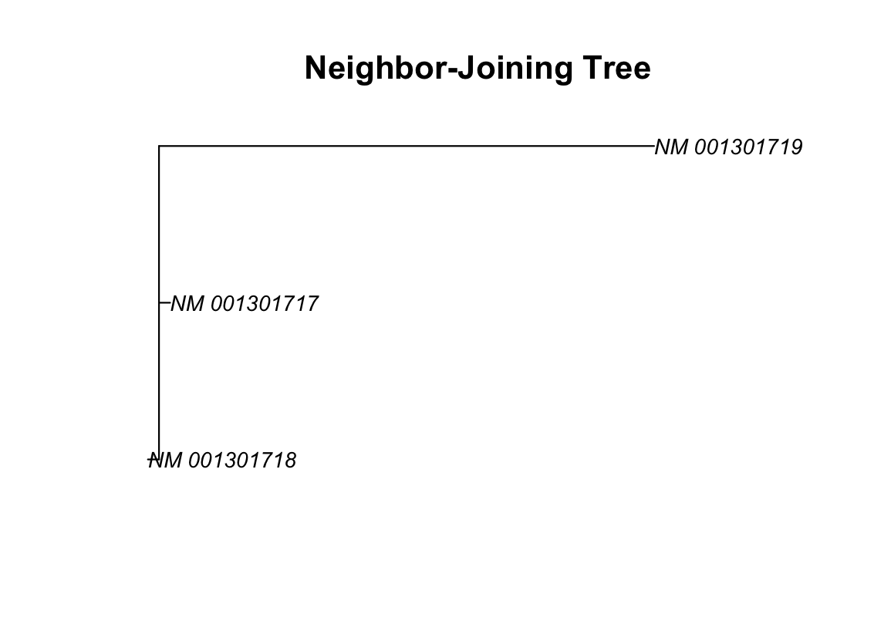

[](https://cran.r-project.org/package=blastar) [](https://opensource.org/licenses/MIT) [](https://github.com/loukesio/blastar/actions/workflows/R-CMD-check.yaml)


## Install the `blastr` package

*The name **blastar** comes from the Greek word [βλαστάρι](https://el.wiktionary.org/wiki/βλαστάρι), which stands for the fresh, tender shoot of a plant. It evokes the idea of growth, branching, and organic evolution — all essential metaphors for phylogenetic exploration.*

Install the package using the following commands   

```r
# for now, you can install the developmental version of ltc
# first you need to install the devtools package 
# in case you have not already installed
install.packages("devtools") 
# and load it
library(devtools)

# then you can install the dev version of the ltc
devtools::install_github("loukesio/blastr")
# and load it
library(blastr)
```

<br>

## Explaining the functions 

### 1.`fetch_metadata` allows fast retrieval of data from NCBI

You can control whether you download the **full sequence** or just a **specific part** using the `seq_range` argument in `fetch_metadata()`:

**1.1. Download the full sequence (default)**  

   ```r
   fetch_metadata(c("NM_001301717", "NM_001301718"), db = "nuccore") #Fetches the entire sequence for each accession.
   ```


**1.2. Download the same range (e.g., bases 100–300) for all accessions**
   Use a numeric vector of length 2.

   ```r
   fetch_metadata(
     accessions = c("NM_001301717", "NM_001301718"),
     db = "nuccore",
     seq_range = c(100, 300)
   )
   ```

**1.3. Download a custom range for each accession**
   Use a named list where each element is a range for one accession.

   ```r
   fetch_metadata(
     accessions = c("NM_001301717", "NM_001301718"),
     db = "nuccore",
     seq_range = list(
       "NM_001301717" = c(50, 150),
       "NM_001301718" = c(200, 400)
     )
   )
   ```
<sup>Created on 2025-06-19 with [reprex v2.1.1](https://reprex.tidyverse.org)</sup>

If an accession is not listed in the `seq_range` list, its **full sequence** will be fetched by default.


---

### 2. `align_sequences` Align Real NCBI Sequences 🧬

**2.1 from the first function `fetch_metadata()` we retrieve our seuqences and then we align them with `align_sequences()`.**

```
test <- 
  fetch_metadata(
    accessions = c("NM_001301717", "NM_001301718"),
    db = "nuccore",
    seq_range = list(
      "NM_001301717" = c(50, 150),
      "NM_001301718" = c(200, 400)
    )
  )

# View the sequences
test$sequence
#> [1] "GTGGTTGGGCGTAAACGTGGACTTAAACTCAGGAGCTAAGGGGGAAACCAATGAAAAGCGTGCTGGTGGTGGCTCTCCTTGTCATTTTCCAGGTATGCCTG"                                                                      #> [2] "TGCTGGTGGTGGCTCTCCTTGTCATTTTCCAGGTATGCCTGTGTCAAGATGAGGTCACGGACGATTACATCGGAGACAACACCACAGTGGACTACACTTTGTTCGAGTCTTTGTGCTCCAAGAAGGACGTGCGGAACTTTAAAGCCTGGTTCCTCCCTATCATGTACTCCATCATTTGTTTCGTGGGCCTACTGGGCAATG"
```

**2.2 Align them globally (Needleman–Wunsch)**
```
result <- align_sequences(
  df            = test,
  method        = "pairwise",
  pairwise_type = "global"
)

result$alignment       # alignment object with gaps

#> Global PairwiseAlignmentsSingleSubject (1 of 1)

#> pattern: -----GTGGTTGGGC-----GTAAACGTGGACTT...-----CATTTTCCAGGTATGCCT----------G
#> subject: TGCTGGTGGTGGCTCTCCTTGTCATTTTCCAGGT...TCCATCATTTGTTTCGTGGGCCTACTGGGCAATG

#> score: -579.9174

result$pid             # Percent identity (`pid`) as a simple similarity score
#> [1] 34.69388

```

<sup>Created on 2025-06-19 with [reprex v2.1.1](https://reprex.tidyverse.org)</sup>

### 3. `build_nj_tree` Build and Plot a Phylogenetic Tree 🌿 

```
# 1. Fetch multiple NCBI sequences
meta <- fetch_metadata(
  accessions = c("NM_001301717", "NM_001301718", "NM_001301719"),
  db = "nuccore",
  seq_range = c(100, 300)  # use same region for comparability
)

# 2. Multiple sequence alignment (ClustalOmega)
msa <- align_sequences(
  df = meta,
  method = "msa",
  msa_method = "ClustalOmega"
)

# 3. Build a Neighbor-Joining tree
tree <- build_nj_tree(msa)

# 4. Plot the tree
plot(tree, main = "Neighbor-Joining Tree", cex = 0.8)
```

 
